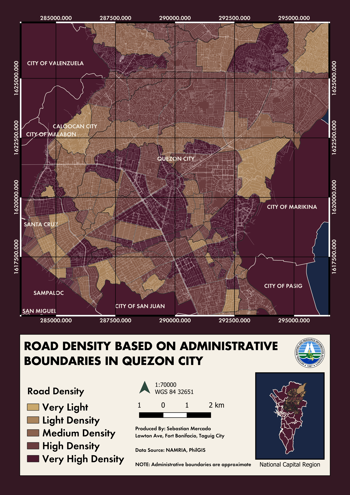

# Quezon City Road Density Analysis
#EPSG:32651 - WGS 84

## Description
GIS project analyzing road density across Quezon City barangays.

## Tools Used
- QGIS
- OpenStreetMap
- QuickOSM

## Data Sources
- OpenStreetMap
- Philippine Administrative Boundaries

## Outputs

## Author
Sebastian Mercado
